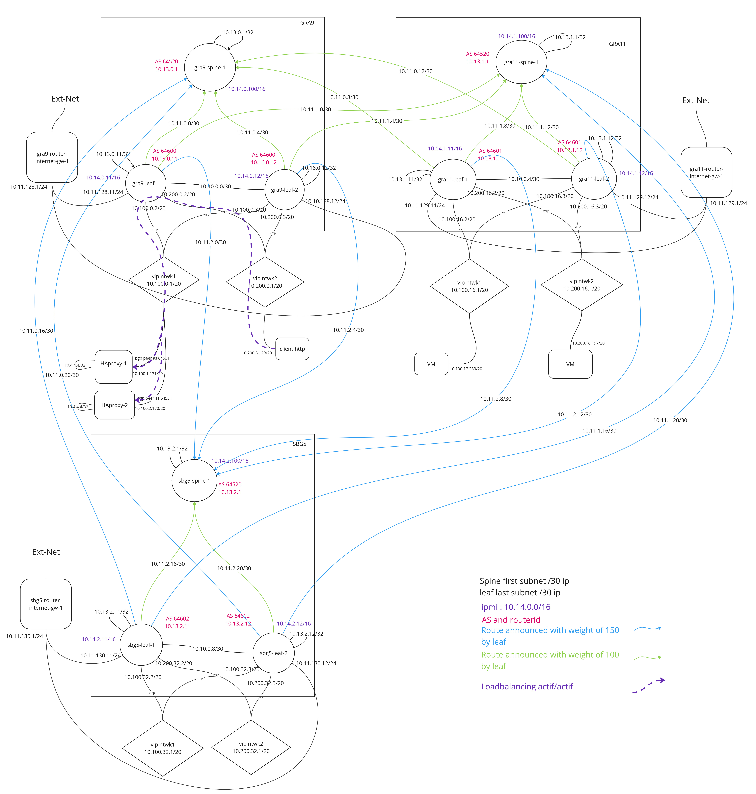

# OVH private network multi zone multi public cloud project

## Goal

We wanna be abble to create multiple OVH public cloud project and multiple private network (vlan) in differents AZ (openstack region, GRA9, SBG5, UK1, ...)
and let VMs from any project, vlan and region being abble to communicate eachother. (with possibility to setup a firewall to limit communications)

## Trouble

First of all we try to use openstack router that OVH offer. Problem come from VMs in differents Public cloud projects and differents vlan even in the same region openstack router aren't able to route packet even with manually setup static routes...

## TroubleShoot

Because of lack of visibility we setup manually router VMs to replace openstack routers with the same topology and in this way it works !

Problem with this topology is that we don't have hich availibility in our network infrastructure, and we have to set mannually all network static router (:boring:)

## Resolution

Finally we choose to use a spine leaf network topoloy which permit us to have hig availibility and cherry on the cake to being able to do loabalancing actif actif on our services with bgp multipath and ECMP.

## bird configuration

Example of [bird configuration](./bird/bird.conf) used on VM "HAproxy" to enable actif/actif loadbalancing

